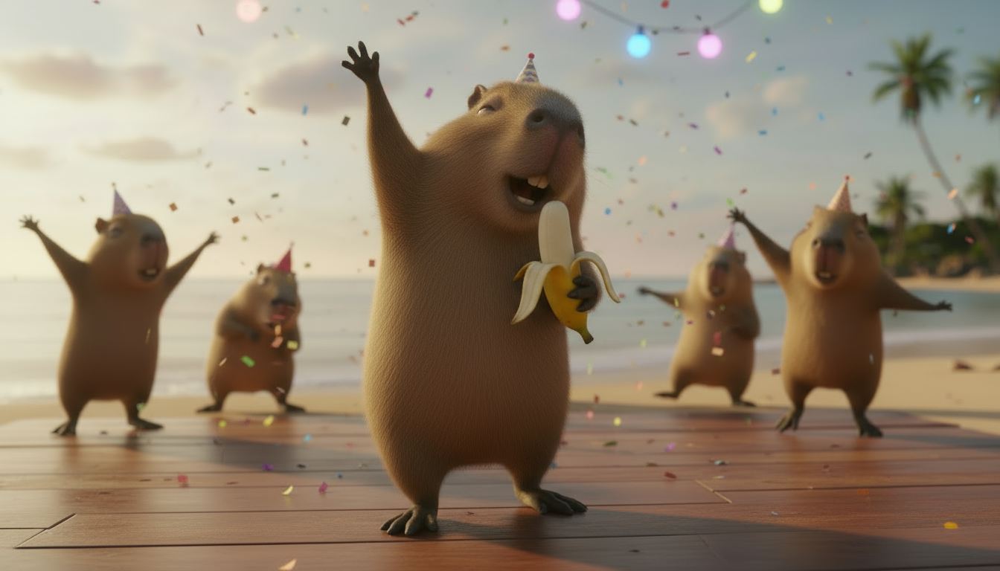
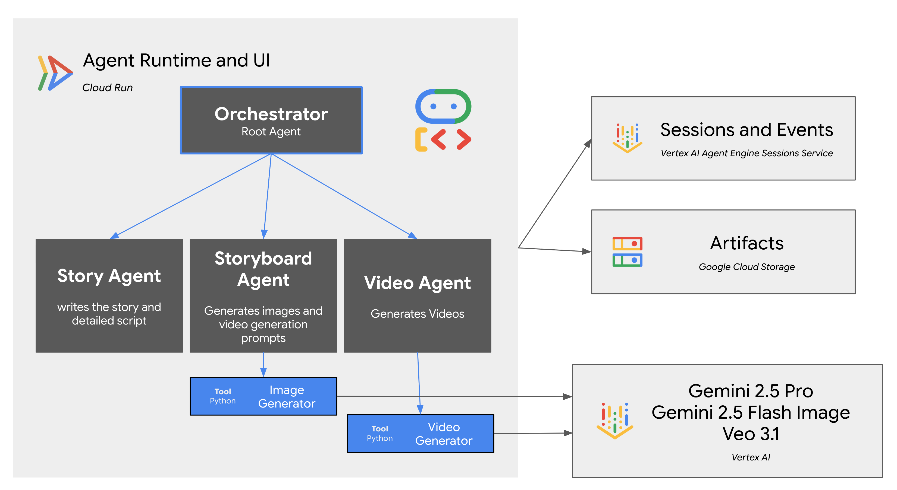

# Video Generation Agent

This repository demonstrates how to build a video generation agent using the [Google Agent Development Kit (ADK)](https://google.github.io/adk-docs/), [Gemini 2.5 Flash Image (Nano Banana)](https://cloud.google.com/vertex-ai/generative-ai/docs/models/gemini/2-5-flash-image?utm_campaign=CDR_0xc245fc42_default_b443956672&utm_medium=external&utm_source=blog), and [Veo 3.1](https://console.cloud.google.com/vertex-ai/publishers/google/model-garden/veo-3.1-generate-preview?utm_campaign=CDR_0xc245fc42_default_b443956672&utm_medium=external&utm_source=blog).

It is a full-stack web application designed to be deployed on [Google Cloud Run](https://cloud.google.com/run/docs/overview/what-is-cloud-run?utm_campaign=CDR_0xc245fc42_default_b443956672&utm_medium=external&utm_source=blog), with ADK Web UI,
using [Vertex AI Agent Engine Sessions Service](https://cloud.google.com/vertex-ai/generative-ai/docs/agent-engine/sessions/overview?utm_campaign=CDR_0xc245fc42_default_b443956672&utm_medium=external&utm_source=blog) for session management and [Google Cloud Storage](https://cloud.google.com/storage/docs/introduction?utm_campaign=CDR_0xc245fc42_default_b443956672&utm_medium=external&utm_source=blog) for storing artifacts.

## Features

* **Story Generation**: Creates a story with a plot and character descriptions.
* **Storyboard Creation**: Generates storyboards for each shot of the story, including first and last frames.
* **Video Generation**: Produces video clips for each shot using the generated storyboards.



*Capybara dancing with a banana - a keyframe for Veo 3.1, generated with Nano Banana*

## Architecture

The video generation agent is composed of a main agent and three sub-agents:

1. **Root Agent (Orchestrator)**: The main agent that orchestrates the video generation process. It takes user input and delegates tasks to the appropriate sub-agent.
2. **Story Agent**: Responsible for creating the story, including the plot and character descriptions.
3. **Storyboard Agent**: Generates the storyboard for each shot, including the first and last frames. It uses the Gemini 2.5 Flash Image model (Nano Banana) to generate the images while preserving character and scene consistency.
4. **Video Agent**: Creates the video for each shot using the Veo 3.1 model. It takes the first and last frames from the storyboard and generates a video that transitions between them.

The Orchestrator performs [delegatio](https://google.github.io/adk-docs/agents/multi-agents/#b-llm-driven-delegation-agent-transfer) to sub-agents through various stages - from building the story to generating videos.
The reason for using LLM-driven delegation rather than a [SequentialAgent](https://google.github.io/adk-docs/agents/workflow-agents/sequential-agents/#sequential-agents) for a sequential workflow is because the process
is iterative, and the user may potentially jump multiple steps back to make corrections in the story or media generation prompts.



## Prerequisites

* An existing [Google Cloud Project](https://console.cloud.google.com/?utm_campaign=CDR_0xc245fc42_default_b443956672&utm_medium=external&utm_source=blog). New customers [**get $300 in free credits**](https://cloud.google.com/free?utm_campaign=CDR_0xc245fc42_default_b443956672&utm_medium=external&utm_source=blog) to run, test, and deploy workloads.
* [Google Cloud SDK](https://cloud.google.com/sdk/docs/install?utm_campaign=CDR_0xc245fc42_default_b443956672&utm_medium=external&utm_source=blog).
* [Python 3.11+](https://www.python.org/downloads/?utm_campaign=CDR_0xc245fc42_default_b443956672&utm_medium=external&utm_source=blog).

## Installation

1. Clone the repository:

    ```bash
    git clone https://github.com/vladkol/media-generation-agent.git
    cd media-generation-agent
    ```

2. Create a Python virtual environment and activate it:

    > We recommend using [`uv`](https://docs.astral.sh/uv/getting-started/installation/)

    ```bash
    uv venv .venv
    source .venv/bin/activate
    ```

3. Install the Python dependencies:

    ```bash
    uv pip install pip
    uv pip install -r agent/requirements.txt
    ```

## Configuration

1. Create a `.env` file in the root of the project by copying the `.env-template` file:

    ```bash
    cp .env-template .env
    ```

2. Update the `.env` file with your Google Cloud project ID, location, and the name of your GCS bucket for AI assets.

## Running Locally

To run the agent locally, use the `run_local.sh` script:

```bash
./deployment/run_local.sh
```

This will:

1. Register an Agent Engine resource for using with the session service.
2. Start a local a web server with the ADK Web UI, which you can access in your browser.

## Deployment

To deploy the agent to Cloud Run, use the `deploy.sh` script:

```bash
./deployment/deploy.sh
```

This script will:

1. Register an Agent Engine resource for using with the session service.
2. Deploy the agent to Cloud Run, with the ADK Web UI.

## Agent Details

The agent's behavior is defined by the prompts in the `agent/video_generation/prompts` directory.

* **`story_agent.md`**: This prompt instructs the agent on how to create a story, including the plot and character descriptions.
* **`storyboard_agent.md`**: This prompt guides the agent in creating a storyboard for each shot, including generating the first and last frames.
* **`video_agent.md`**: This prompt tells the agent how to generate a video for each shot using the storyboard frames.

The agent uses the following tools:

* **`nano_banana_tool.py`**: A tool for generating images using the Gemini 2.5 Flash Image model.
* **`veo3_agent.py`**: A tool for generating videos using the Veo 3.1 model.
